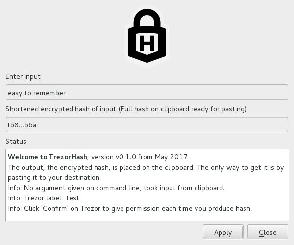

# 

# TrezorHash

**:star: :lock: :star: Use your [Trezor](http://www.trezor.io/) device to create an encrypted hash of an input string :star: :lock: :star:**

`TrezorHash` is a small, simple tool that
allows you to compute an encrypted digest of an input message using the Trezor device.

# Features

* Encrypted [hash](https://en.wikipedia.org/wiki/Cryptographic_hash_function)
    * deterministic, same input (message) leads to same output (digest)
    * quick
    * infeasible to determine input from output without brute-forcing
* Possible applications:
    * Pseudorandom bit generation
    * [Key derivation](https://en.wikipedia.org/wiki/Key_derivation_function):
        Convenient tool to convert a simple, short, and easy to remember
        string into a long string that is very difficult to guess or brute-force
    * [Password verification](https://en.wikipedia.org/wiki/Password_hashing):
        Allows you to know if inputs are the same without knowing the input values,
        a useful piece for password management
    * Create personal digital signatures of short texts like emails,
        i.e. data identity and data integrity
* Trezor convenience
* Trezor security
* Trezor privacy, only your Trezor can generate the same output (digest)
* One Trezor for all your needs: [gpg](https://github.com/romanz/trezor-agent),
    [ssh](https://github.com/romanz/trezor-agent),
    [symmetric encryption](https://github.com/8go/TrezorSymmetricFileEncryption),
    [password management](https://github.com/8go/TrezorPass),
    [encrypted hashes](https://github.com/8go/TrezorHash), etc.
* Requires confirmation button click on Trezor device to compute the hash.
    (Optionally this can be turned off for automated mass-processing.)
* It supports both GUI mode and Terminal mode.
* Since it is a program that has a full CLI (command line interface)
  it is easy to create scripts or to automate workflows. Keep in mind though
  that unless specifically turned off you will have to confirm on the
  Trezor by clicking its `Confirm` button.

# Screenshot

Below a sample screenshot. More screenshots [here](screenshots).



# Build and runtime requirements

  * [Trezor](https://www.trezor.io) device
  * [Python](https://www.python.org/) v2.7 or 3.4+
  * PyCrypto
  * PyQt4
  * [trezorlib from python-trezor](https://github.com/trezor/python-trezor)

# Building

Even though the whole code is in Python, there are few Qt4 `.ui` form files that
need to be transformed into Python files. There is `Makefile`, you just need to run

    make

## Build requirements

PyQt4 development tools are necessary, namely `pyuic4` (look for packages named
like `pyqt4-dev-tools` or `PyQt4-devel`).

# Running

Run:

    python TrezorHash.py
or

    python3 TrezorHash.py

Run-time command line options are

```
TrezorHash.py [-h] [-v] [-t [-m]] [-l <loglevel>] [-n] [<input> [<inputs>]]
This program takes an input message via CLI, clipboard or GUI, and
deterministically creates a Trezor-specific encrypted hash (digest).
For the same 24 Trezor seeds, independent of passphrase and other
parameters, it always returns the same output.
It is a one-way function. One cannot compute the input given the output.
Output length is always the same, 64 letters from alphabet [a-z0-9].
The output digest has 256 bits.
Different inputs will with near-vcertainty lead to different outputs.
The output is difficult to guess or brute-force.
In GUI mode the output is never written to a file or storage. It remains
only in memory. It is passed to the user exclusively via the clipboard.
When the GUI is closed, the clipboard is automatically overwritten
and cleared. So, the output digest must be pasted before closing
the GUI.

Possible use-cases of TrezorHash include:
* Pseudorandom bit generation
* Key derivation:
    Convenient tool to convert a simple, short, and easy to remember
    string into a long string that is very difficult to guess or brute-force
* Password verification:
    Allows you to know if inputs are the same without knowing the input values,
    a useful piece for password management
* Data identity and data integrity:
    Create personal digital signatures of short texts like emails.

-v, --version
        Print the version number
-h, --help
    Print help text
-l, --logging
    Set logging level, integer from 1 to 5, 1=full logging, 5=no logging
-t, --terminal
        Run in the terminal, this avoids the GUI. In terminal mode the
        output is written to stdout
-m, --multiple
        With `-m` in terminal mode instead of one input, multiple
        input strings can be given as command line arguments for batch
        processing.
-n, --noconfirm
        Eliminates the `Confirm` click on the Trezor button. Useful for
        batch processing. Be very aware that for security reasons
        the resulting output digest is *different* if `-n` is used!
<input>
        Message, a string, to be hashed and encrypted.
        If no input is given then program will look at the clipboard for input.
        If input argument is missing and clipboard is empty program will ask
        user for input.

Example usage:
TrezorHash.py -t a
Input:  "a"
Output: "01dc56a86a759a00f4bf1b7e43789092ec197ed302ee799e11eaa18106f84e03"

TrezorHash.py -t -n a # note the different output!
Input:  "a"
Output: "c038754a62b903e2a4630b9cedf562e9711cc36c1faef39c2c11c334042686ea"

TrezorHash.py
Input:  "Easy to remember"
Output: "626020f7a90752f40abdff004861359b267caf3db7c15d64b1e38dd3cfa5e45d"

Keyboard shortcuts of GUI:
Apply, Hash: Control-A, Control-S
Cancel, Quit: Esc, Control-Q
Version, About: Control-T

Requires: python 2.7 or 3.4+ and PyQt4 and trezorlib library.
Tested on Linux on Python 2.7 and 3.4.

BTW, for testing 'xsel -bi', 'xsel -bo' and 'xsel -bc' set, write and clear the clipboard on Linux.
```

# Testing

No automated test tool exists.

# FAQ - Frequently Asked Questions

**Question:** What are the command line options?

**Answer:** See description above. You can do everything by command line without GUI.
- - -
**Question:** What crypto technology is used?

**Answer:** At the heart of it all is the
python-trezor/trezorlib/client.py/encrypt_keyvalue()
function of the Python client library of [Trezor](https://www.trezor.io)
(AES-CBC encryption).
- - -
**Question:** What hashing technology is used?

**Answer:** [sha256](https://en.wikipedia.org/wiki/Sha256) is used.
- - -
**Question:** Does TrezorHash require online connectivity,
Internet access?

**Answer:** No.
- - -
**Question:** How many files are there?

**Answer:** If you have Python installed, then there are just a
handful of Python files. Alternatively, if you don't want to
install Python one can create a single-file-executable
with tools like [pyinstaller](www.pyinstaller.org). In that case you just have a
single-file-executablefile.
- - -
**Question:** In which language is TrezorHash written?

**Answer:** [Python](https://www.python.org/). It will currently run on Python 2.7 and 3.4+.
- - -
**Question:** Do I need to have a [Trezor](https://www.trezor.io/) in
order to use TrezorHash?

**Answer:** Yes, a Trezor is required.
- - -
**Question:** Is there any limit on the length of the input string?

**Answer:** Yes. The GUI has a limit of 32767 bytes (32K). On the CLI
the theoretical limit is around 2G. However, your OS might have a smaller limit.
- - -
**Question:** Can I see the source code?

**Answer:** Yes, this is an open source software project.
You can find and download all source code from
[Github](https://github.com/8go/TrezorHash) or
any of its forks.
- - -
**Question:** Does the TrezorHash contain ads?

**Answer:** No.
- - -
**Question:** Does TrezorHash cost money?

**Answer:** No. It is free, libre, and open source.
- - -
**Question:** Does TrezorHash call home?
Send any information anywhere?

**Answer:** No. Never. You can also use it on an air-gapped computer if you
want to. It does not contain any networking code at all. It does not update
itself automatically. It cannot send anything anywhere.
- - -
**Question:** Does TrezorHash have a backdoor?

**Answer:** No. Read the source code to convince yourself.
- - -
**Question:** How can I know that TrezorHash does not contain a virus?

**Answer:** Download the source from
[Github](https://github.com/8go/TrezorHash)
and inspect the source code for viruses. Don't download it from unreliable sources.
- - -
**Question:** Can someone steal or duplicate the key used for encryption or decryption?

**Answer:** No, the key used for encryption never leaves the Trezor.  
- - -
**Question:** Can a keyboard logger steal the output hash?

**Answer:** No, not if you use the clipboard.
- - -
**Question:** Can a screen grabber or a person looking over my shoulder
steal the output hash?

**Answer:** No, the GUI only shows a drastically shortened version of the
output hash.
- - -
**Question:** Is TrezorHash portable?

**Answer:** Yes. It is just a handful of Python files
or a single-file-executable.
You can move it around via an USB stick, SD card, email or cloud service.
- - -
**Question:** Can I contribute to the project?

**Answer:** Yes. It is open source.
Go to [Github](https://github.com/8go/TrezorHash).
You can also help by getting the word out.
If you like it or like the idea please spread the word on Twitter, Reddit,
Facebook, etc. It will be appreciated.
- - -
**Question:** On which platforms, operating systems is
TrezorHash available?

**Answer:** On all platforms, operating systems where
[Python](https://www.python.org/) and PyQt4 is available: Windows, Linux, Unix,
Mac OS X. Internet searches show Python for Android and iOS,
but it has not been investigated or tested on Android or iOS.
Testing has only been done on Linux.
- - -
**Question:** Are there any warranties or guarantees?

**Answer:** No, there are no warranties or guarantees whatsoever.
- - -
**Question:** More questions?

**Answer:** Let us know.
- - -

# To-do List

- [ ]  There is a bug in Qt4 not allowing foreign characters to be entered
via the Alt-Gr keys from
the keyboard in the password field (used to read Trezor passphrase).
A work around could be written. Immediate work around is copy-paste.


</> on :octocat: with :heart:
